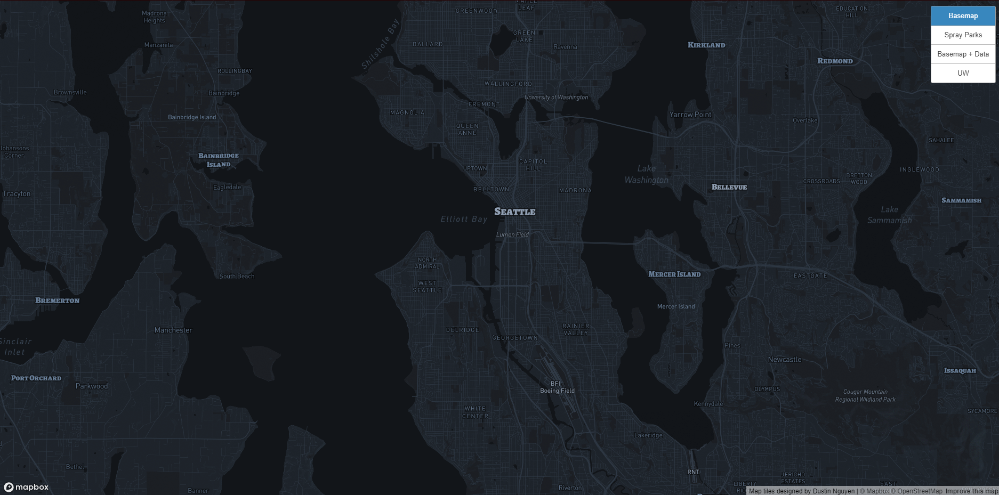
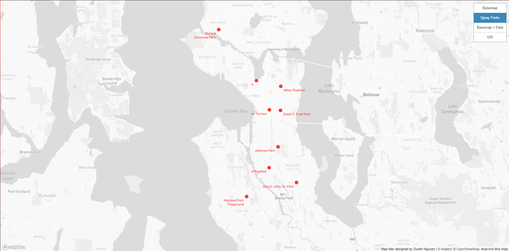
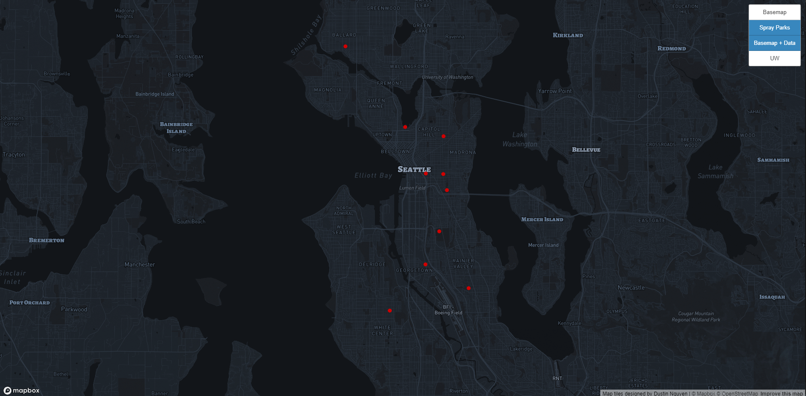
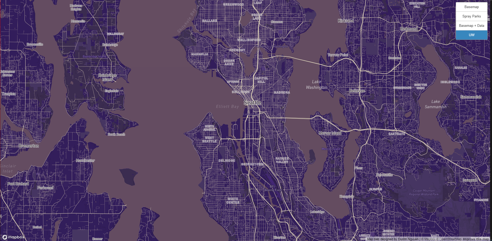

# Tilesets
Each tileset examines the Seattle area. The initial zoom is 12, but the map can be zoomed up to 11.

[Link to Tilesets](https://DustNguyen.github.io/tileset_generation/index.html)

This tileset is a modified basemap with a blue color scheme.

This tileset is a data layer showing the location of recreational parks around Seattle.

This tileset uses the modified basemap and the data layer from the previous tiles.

A tileset created using the color scheme from the University of Washington.